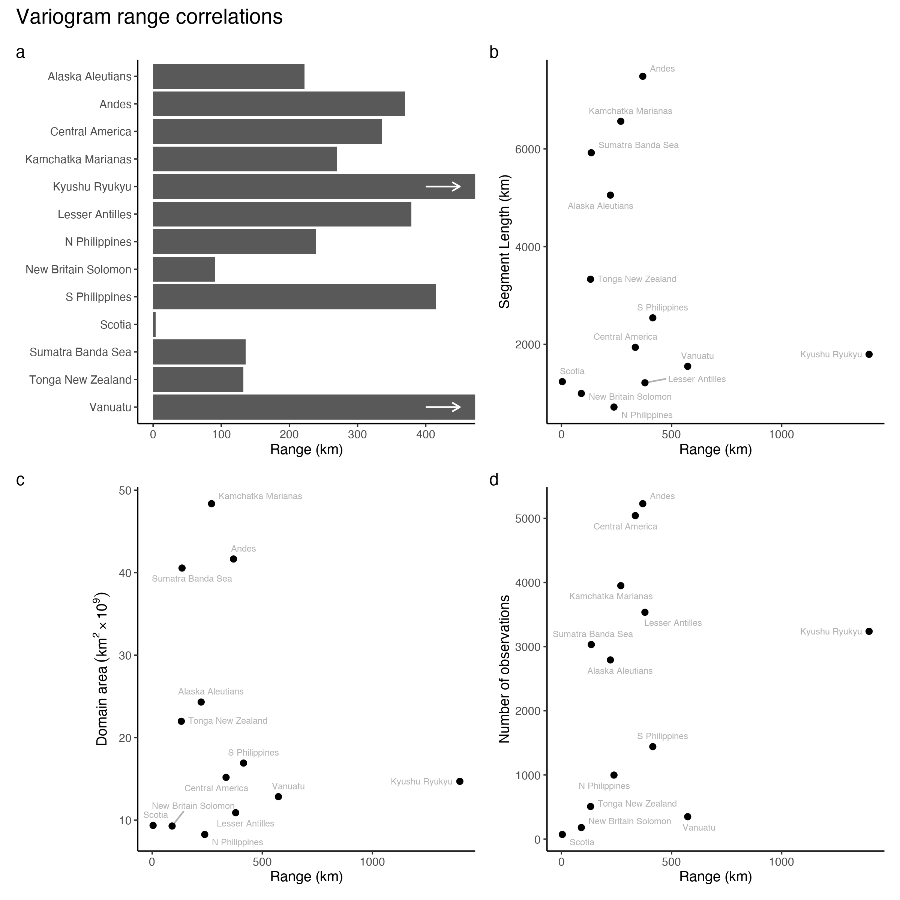
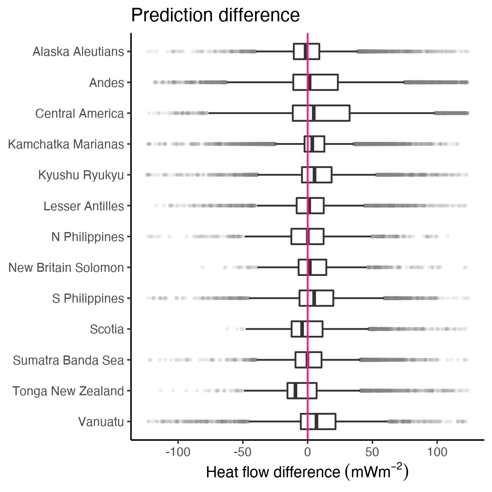
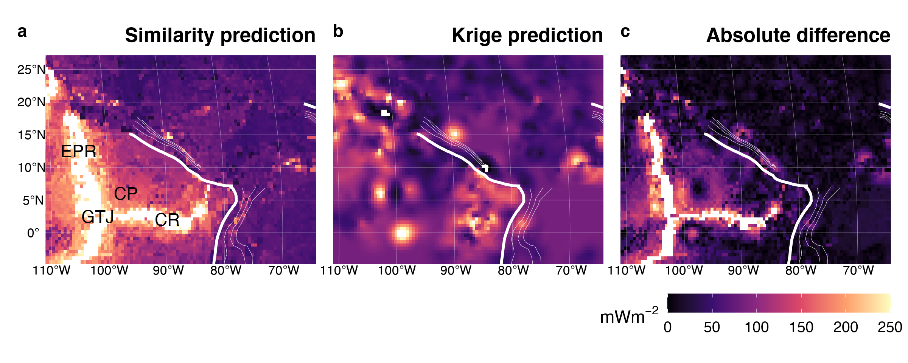
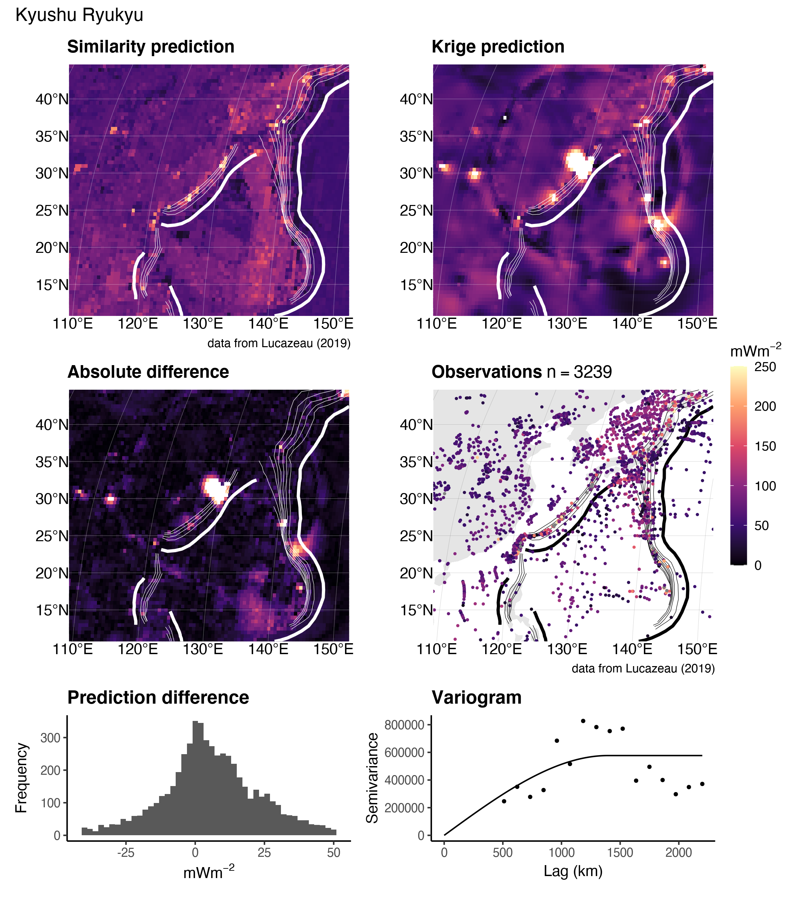
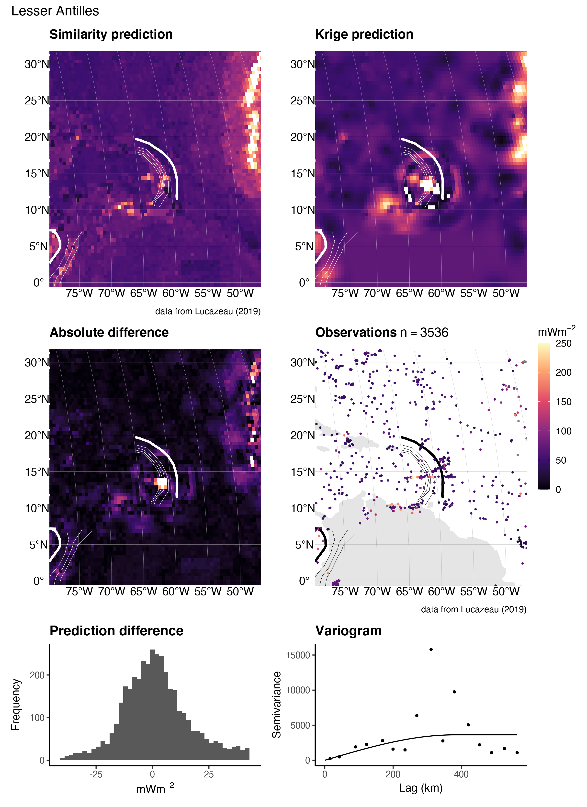
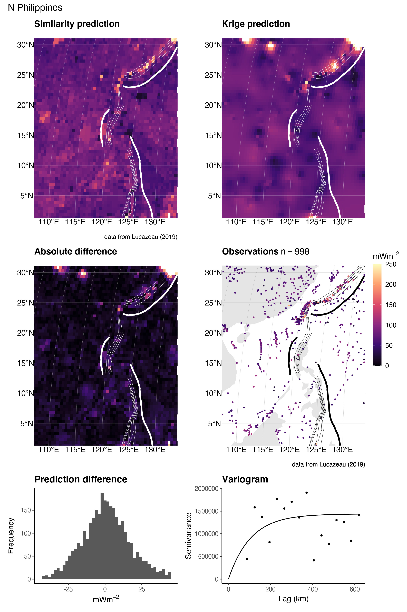

```{r echo=FALSE, message=FALSE}
# Some recommended settings
knitr::opts_chunk$set(
  echo=FALSE,
  message=FALSE,
  fig.pos='h',
  out.extra="",
  fig.align='center',
  out.width='95%'
)

# Load functions and libraries
suppressMessages(source('../functions.R'))
suppressMessages(load('../data/hf.Rdata'))

# Define paths and names
fpath <- list.files('../data/diff', pattern = '.RData', full.names = T)
fname <- purrr::map_chr(
  list.files('../data/diff', pattern = '.RData'),
  ~.x %>%
  stringr::str_replace('.RData', ''))

# Load data
for (i in fpath) load(i)

# Bounding Boxes
purrr::map(
  seg.names,
  ~shp.sa.segs.robin.pacific.buffer %>%
  filter(segment == .x) %>%
  st_bbox() %>%
  bbox_widen(
    crs = proj4.robin.pacific,
    borders = c(
      'top' = 0.1,
      'bottom' = 0.1,
      'left' = 0.1,
      'right' = 0.1))) %>%
purrr::set_names(nm = seg.names) -> shp.box

# Crop data
purrr::map2_df(
  shp.box,
  seg.names,
  ~shp.hf %>%
  rename(hf = `heat-flow (mW/m2)`) %>%
  st_crop(.x) %>%
  mutate(segment = .y, .before = country)) -> shp.hf.crop

# Summarize heat flow data
shp.hf.crop %>%
mutate('segment' = segment %>% stringr::str_replace_all('_', ' ')) %>%
st_set_geometry(NULL) %>%
group_by(segment) %>%
rename(Segment = segment) %>%
summarise(
  n = n(),
  Min = round(min(hf)),
  Max = round(max(hf)),
  Median =round(median(hf)),
  IQR = round(IQR(hf)),
  Mean = round(mean(hf)),
  Sigma = round(sd(hf))) -> hf.summary

# Summarise variogram models
purrr::map_df(
  fname,
  ~get(.x)$v.mod,
  .id = 'segment') %>%
  as_tibble() %>%
  mutate('segment' = fname %>% stringr::str_replace_all('_', ' ')) %>%
  dplyr::select(segment, model, psill, range) %>%
  mutate('psill' = round(sqrt(psill)), 'range' = round(range/1000)) %>%
  rename(
    Segment = segment,
    Model = model,
    `Sill $[mWm^{-2}]$` = psill,
    `Range $[km]$` = range) -> variogram.summary

# Interpolation difference
purrr::map(fname, ~get(.x)$diff %>% st_set_geometry(NULL)) %>%
purrr::set_names(nm = fname %>% stringr::str_replace_all('_', ' ')) -> hf.diff

hf.diff %>%
bind_rows(.id = 'Segment') %>%
group_by(Segment) %>%
summarise(
  Min = round(min(hf.diff)),
  Max = round(max(hf.diff)),
  Median = round(median(hf.diff)),
  IQR = round(IQR(hf.diff)),
  Mean = round(mean(hf.diff)),
  Sigma = round(sd(hf.diff))) -> hf.diff.summary
```

# Introduction

Heat escaping the solid Earth's surface indicates a dynamically cooling planet. Surface heat flow databases [@pollack1993; @hasterok2008; @lucazeau2019] provide a way to investigate and quantify geodynamics by relating the amount of heat escaping Earth's surface to heat-transferring and heat-generating subsurface processes such as diffusion, hydrothermal circulation, radioactive decay, fault motion, subduction dynamics, and mantle convection [@fourier1827; @parsons1977; @pollack1977; @stein1992; @hasterok2013; @stein1994; @rudnick1998; @furlong2013; @gao2014; @furukawa1993; @wada2009; @kerswell2020; @currie2004; @currie2006]. Surface heat flow observations continue to motivate research, evident by more than 1,393 publications compiled in the most recent heat flow database, although the rate of publications using surface heat flow has declined since the mid 1980's [@jennings2021].

Questions such as calculating the global surface heat flux from continents and oceans require interpolating discrete heat flow observations onto a continuous approximation of Earth's surface. Interpolation attempts commonly use one or more geographic, geologic, geochronologic, or geophysical proxies to predict heat flow at unknown locations by association with similar observation sites [e.g., bathymetry or elevation, proximity to active or ancient orogens, seafloor age, upper mantle shear wave velocities, @chapman1975; @lee1965; @sclater1970; @davies2013; @shapiro2004; @goutorbe2011; @lucazeau2019]. These methods are called *similarity methods* (@fig:lucahf) and follow the assumptions embedded in the Third Law of Geography (hereafter referred to as the Third Law): *the more similar the geographic configuration of two points, the more similar their values* [@zhu2018].

Using prior information in estimation is an advantage of the Third Law and is arguably the most reasonable approach for interpolating surface heat flow. Our understanding of geodynamics and near-surface heat flow perturbations implies a strong relationship between surface heat flow and the set of local physical conditions [e.g., @goutorbe2011], irrespective of the location. For example, younger oceanic plates should have higher surface heat flow than older plates [@stein1992], subducting oceanic plates will lower surface heat flow near trenches [@furukawa1993], and hydrothermal circulation of seawater can modify heat escaping from oceanic crust [@hasterok2011]. Interpolation by the Third Law makes reasoned predictions of heat flow with priors from many independently-tested geodynamic models. Disadvantages of the Third Law include strong bias towards geodynamic models, making determinations where, in fact, deviations from such models occur, and multiple interacting sources of uncertainty from many proxy datasets.

```{r lucahf, fig.cap='Global heat flow. (a) The NGHF database (n = 69729) and (b) interpolation by similarity method. Data from Lucazeau (2019).'}
knitr::include_graphics('../figs/base/hf_luca.png')
```

In contrast to the Third Law, there exists some degree of spatial dependence, or continuity, in the distribution of surface heat flow. A pair of surface heat flow observations taken one meter apart will be strongly correlated. The correlation between pairs of observations will likely decrease with increasing distance between the pairs [@goovaerts1997]. This is encapsulated in the First Law of Geography (hereafter referred to as the First Law): *everything is related, but nearer things are more related* [@krige1951; @matheron1963]. The spatial (dis)continuity of surface heat flow represents the areal extent of geodynamic processes and their interactions. For example, patterns of consistently low surface heat flow outline the areal extent of cratons (@fig:lucahf) and consistent patterns of heat flow near volcanic arcs are interpreted to reflect common backarc lithospheric thermal structures [@currie2004; @currie2006; @hyndman2005] and slab-mantle mechanical coupling depths in subduction zones [@furukawa1993; @wada2009; @kerswell2020].

Predicting surface heat flow by considering many nearby observations [i.e. Kriging, @krige1951] is advantageous because spatial dependence is conserved and uncertainty is only dependent on the distance between pairs of observations [@chiles2009]. However, Kriging is disadvantageous because it assumes that the underlying distribution of heat flow is *stationary* (constant in space and time), which likely fails in geodynamically complex regions. This problem is overcome by relaxing assumptions of stationarity and applying techniques that respect the Second Law of Geography: *spatial phenomena are inherently heterogenous* [@goodchild2004], such as directional Kriging or Markov-Bayes techniques that include proxies as priors [@bardossy1997].

In this study we attempt to answer the following questions: 1) Are global heat flow interpolations predicted by Kriging and similarity methods comparable? 2) What are the implications of the differences according to the implicit assumptions embodied in the First and Third Laws of Geography? 3) Which method is better suited for hypothesis testing? 4) How can the interpolations presented here guide future data collection efforts?

We first use ordinary Kriging to interpolate the New Global Heat Flow (NGHF) database of @lucazeau2019. We then compare our interpolation results to those of @lucazeau2019 and consider the implications of Kriging (First Law) vs. similarity (Third Law) methods of interpolation. We restrict our comparison to areas near subduction zone segments defined by @syracuse2006 for two reasons: 1) to provide heat flow interpolations and statistics useful to subduction zone research, and 2) to emphasize differences and idiosyncrasies in both interpolation approaches in a complex tectonic and thermal setting. We find that Kriging and similarity methods are comparable for most subduction segments. Both interpolations show inconsistent patterns of heat flow and spatial continuity. This result implies sampling heat flow along single trench-perpendicular transects is an incomplete framework for hypothesis testing. Further, inconsistent spatial continuity and heat flow patterns counter hypotheses of common thermal structure and geodynamics among subduction zones. We suggest future research focus on generating high-quality interpolations and discuss considerations for data acquisition priorities.

# Methods

## The NGHF Database

The NGHF database was downloaded from the supplementary material of @lucazeau2019. It contains 69729 data points, their locations in latitude/longitude, and metadata---including a data quality rank (Code 6) from A to D (with Code 6 = Z = undetermined). The reader is referred to @lucazeau2019 for details on compilation, references, and historical perspective on the NGHF and previous compilations. We use NGFH because it is the most recent database available, has been carefully compiled, and is open-access.

Like @lucazeau2019, we exclude 4790 poor quality observations (Code 6 = D) from our analysis. We further remove 350 data points without heat flow observations and two without geographic information. Multiple observations at the same location are parsed to avoid singular covariance matrices during Kriging:

$$\begin{aligned}
	f(X_i^q, Y_i^q) &= \\
	X_i^q > Y_i^q &\rightarrow z_i = x_i \\
	X_i^q < Y_i^q &\rightarrow z_i = y_i \\
	X_i^q = Y_i^q &\rightarrow z_i = RAND(x_i, y_i)
	\end{aligned}$$ {#eq:parse}

where $X_i^q$ and $Y_i^q$ represent the quality of each duplicate observation pair at location $i$, $RAND$ is a random function that selects either the observation $x_i$ or $y_i$, and $z_i$ stores the observation selected by $f(X_i^q, Y_i^q)$. The final dataset used for Kriging has $n=$ 55274 observations after parsing $n=$ 32430 duplicate observation.

## Kriging

Kriging is a three-step process that involves first estimating an experimental variogram, $\hat{\gamma}(h)$, fitting the experimental variogram with one of many variogram models, $\gamma(h)$, and finally using the modelled variogram to predict random variables at unknown locations [@krige1951; @cressie2015]. We use the general-purpose functions defined in the "R" package `gstat` [@graler2016; @pebesma2004] to perform all three steps. We begin by estimating an experimental variogram as defined by @bardossy1997:

$$\hat{\gamma}(h) = \frac{1}{2N(h)}\sum_{N(h)}^{}(Z(u_i) - Z(u_j))^2$$ {#eq:variogram}

where $N(h)$ is the number of pairs of points, $Z(u_i)$ and $Z(u_j)$, separated by a lag distance, $h = |u_i - u_j|$. We evaluate $\hat{\gamma}(h)$ at fifteen lag distances by binning the irregular spaced data with a bin width, $\delta$, equal to a proportion of the maximum lag distance, $c$, divided by the number of lags used to evaluate the variogram. The lag cutoff parameter, $c$, is optimized by genetic algorithm (discussed below). The binwidth is then $\delta = \max (N(h))/(15c)$, and $N(h) \leftarrow N(h, \delta h) = \{i,j:|u_i - u_j| \in [h - \delta h, h + \delta h)\}$. In simple terms, @eq:variogram represents the similarity, or dissimilarity, between pairs of observations in space. @eq:variogram is adheres to the First Law of Geography and is derived from the theory of *regionalized variables* [@matheron1963; @matheron2019], which formally defines a probabilistic framework for spatial interpolation of natural phenomena. It is important for the reader to understand the fundamental assumptions implicit in @eq:variogram in order to understand the comparison of interpolation techniques discussed later. The basic assumptions used in our Kriging method are:

- $\hat{\gamma}(h)$ is directionally invariant (isotropic)

- $\hat{\gamma}(h)$ is evaluated in two-dimensions and neglects elevation, $Z(u) \in \mathbb{R}^2$

- The first and second moments of $Z(u)$ have the following conditions over the domain $D$:

$$
\begin{aligned}
  &E[Z(u)] = mean = constant, &\forall u \in D \\
  &E[(Z(u + h) - mean)(Z(u) - mean)] = C(h), &\forall |u, u + h| \in D
\end{aligned}
$$ {#eq:assumptions}

The last assumption (@eq:assumptions) is called "second-order stationarity" and is implicit in the First Law of Geography. It assumes the underlying probability distribution of the random variable, $Z(u)$, does not change in space and the covariance, $C(h)$, only depends on the distance, $h$, between two random variables. These assumptions are expected to be valid in cases where the underlying natural process is stochastic, spatially continuous, and has the property of additivity such that $\frac{1}{n}\sum_{i=1}^n Z(u_i)$ has the same meaning as $Z(u)$ [@bardossy1997].

The following are two illustrative cases where @eq:assumptions is likely valid:

1. The thickness of a sedimentary unit with a homogeneous concentration of radioactive elements can be approximated by $q_s = q_b + \int A \,dz$, where $q_b$ is a constant heat flux entering the bottom of the layer and $A$ is the heat production within the layer with thickness $z$ [@furlong2013]. If we have two samples, $Z(u_1) = 31~mW/m^2$ and $Z(u_2) = 30.5~mW/m^2$, their corresponding thicknesses would be $Z'(u_1) = 1000~m$ and $Z'(u_2) = 500~m$ for $A = 0.001~mW/m^3$ and $q_b = 30~mW/m^2$. The variable, $Z(u)$, in this case is additive because the arithmetic mean of the samples is a good approximation of the average sedimentary layer thickness, $(Z(u_1) + Z(u_2)) / 2 = 750~m$.

2. The age of young oceanic lithosphere can be approximated by $q_s(t) = kT_b(\pi\kappa t)^{-1/2}$, where $q_s(t)$ is the surface heat flow of a plate with age, $t$, $T_b$ is the temperature at the base of the plate, $k$ is thermal conductivity, and $\kappa = k/\rho C_p$ is thermal diffusivity [@stein1992]. For $k = 3.138~W/mK$, $\rho = 3330~kg/m^3$, $C_p = 1171~J/kgK$, $T_b = 1350^{\circ}C$, two samples, $Z(u_1) = 180~mW/m^2$ and $Z(u_2) = 190~mW/m^2$, would correspond to plates with ages of $Z'(u_1) = 10~Ma$, and $Z'(u_2) = 9~Ma$, respectively. Since $Z(u_1) + Z(u_2) / 2 = 185~mW/m^2$ and $Z'(185~mW/m^2) = 9.5~Ma = Z'(u_1) + Z'(u_2) / 2$, the variable $Z(u)$ in this case is also additive.

In contrast, @eq:assumptions is likely invalid in regions that transition among two or more tectonic regimes. For example, the expected heat flow $E[Z(u)] = mean$ will change when moving from a spreading center to a subduction zone. $E[Z(u)] = mean \neq constant$ over the region of interest. Proceeding with @eq:assumptions in this case has the effect of masking the geodynamic complexity. In other words, the First Law of Geography is violated and the geodynamic complexity will be *invisible* to Kriging predictions unless heatflow observations are sufficiently dense. We will see that this has important implications when comparing our Kriging method to @lucazeau2019's interpolation method, which is exactly opposite of this formalism---it only considers the similarities among physical proxies and not spatial dependence.

The second step is to fit the experimental variogram with a variogram model, $\gamma(h)$. In this study we fit two popular variogram models to the experimental variogram. We use models with sills, which implies the spatial dependence between pairs of points has a finite range. The spherical and exponential variogram models used in this study are defined as [@chiles2009; @cressie2015]:

$$
\begin{aligned}
  sph &\leftarrow \gamma(h) =
  \begin{cases}
    n + s \left(\frac{3h}{2a} - \frac{1}{2}\left(\frac{h}{a}\right)^3\right), & \text{if } 0 \leq h \leq a \\
    n + s, & \text{if } h > a
  \end{cases} \\
exp &\leftarrow \gamma(h) = n + s \left(1 - exp\left(\frac{-h}{a}\right)\right), ~\quad\text{if } h \geq 0 \\
\end{aligned}
$$ {#eq:varmodels}

where $n$ is the nugget, $s$ is the sill, and $a$ is the effective range. The effective range, $a$, is related to the range, $r$, by $a = r$ and $a = r/3$ for spherical and exponential models, respectively [@graler2016; @pebesma2004]. We use the function `fit.variogram` in `gstat` to try both variogram models. The best model is selected by the minimum misfit by weighted least square [WLS, @pebesma2004].

We use ordinary Kriging for our interpolation step, which predicts the value of a random function, $\hat{Z}(u)$, at unknown locations as a linear combination of all known locations in the domain, $D$ [@bardossy1997]:

$$ \hat{Z}(u) = \sum_{i=1}^n \lambda_i Z(u_i), \quad \forall u \in D $$ {#eq:linestimate}

The conditions in @eq:assumptions set up a constrained minimization problem since one has:

$$ E[Z(u)] = mean, \quad \forall u \in D $$ {#eq:firstmoment}

The linear estimator must obey

$$ E[\hat{Z}(u)] = \sum_{i=1}^n \lambda_i E[Z(u_i)] = mean $$ {#eq:explinestimate}

so the weights must be

$$ \sum_{i=1}^n \lambda_i = 1 $$ {#eq:unbiased}

This is the first constraint, also known as the unbiased condition, which states that the sum of the weights must equal one. However, there is an infinite set of real numbers one could use for the weights, $\lambda_i$. Our goal is to find the set of weights in @eq:linestimate that minimizes the estimation variance. This can be solved by minimizing the covariance function, $C(h)$ from @eq:assumptions:

$$
\begin{aligned}
  \sigma^2(u) = Var[Z(u) - \hat{Z}(u)] = E\left[(Z(u) - \sum_{i=1}^n \lambda_i Z(u_i))^2\right] &= \\
  E\left[Z(u)^2 + \sum_{j=1}^n \sum_{i=1}^n \lambda_j \lambda_i Z(u_j)Z(u_i) - 2 \sum_{i=1}^n \lambda_i Z(u_i)Z(u)\right] &= \\
  C(0) + \sum_{j=1}^n \sum_{i=1}^n \lambda_j \lambda_i C(u_i - u_j) - 2 \sum_{i=1}^n \lambda_i C(u_i - u)
\end{aligned}
$$ {#eq:minvar}

Minimizing @eq:minvar with respect to the unbiased condition (@eq:unbiased), yields the best linear unbiased estimator [BLUE, @bardossy1997] for @eq:linestimate and together are considered the Kriging system. In our case, this is done by the function `krige` in `gstat`. We use the function `krige.cv` in `gstat` to estimate the misfit between observations and Kriging interpolations by ten-fold cross validation [@pebesma2004].

Further, we use a general purpose genetic algorithm, `ga`, from the R package, `GA` [@scrucca2013; @scrucca2017], to optimize Kriging parameters after @li2018. The results from the genetic algorithm are comparable to the non-genetic-algorithm results. However, some inconsistent variogram fitting by the algorithm is suspect. We present these results and discuss their implications in @sec:ga.

## Map Projection and Interpolation Grid

We interpolate onto the same 0.5$^{\circ}$C x 0.5$^{\circ}$C grid as @lucazeau2019 so a direct difference could be calculated between our interpolation methods and @lucazeau2019's. The NGHF and grid with predicted heat flow from @lucazeau2019 were transformed into a Pacific-centered Robinson coordinate reference system (CRS) defined using the `proj` string [@proj2021]:

~~~
+proj=robin +lon_0=-155 +lon_wrap=-155 +x_0=0 +y_0=0
+ellps=WGS84 +datum=WGS84 +units=m +no_defs
~~~

All geographic operations, including Kriging and taking the difference with @lucazeau2019's heat flow predictions, are performed in the above CRS using the general-purpose functions in the "R" package `sf` [@pebesma2018]. We define the Kriging domain near individual arc segments in two steps: 1) 1000 $km$ buffers are drawn around the arc segments as defined by @syracuse2006. 2) The bounding box of the 1000 $km$ buffer is expanded by 10% on all sides (@fig:segments). We use @lucazeau2019's grid for Kriging predictions so differences can be taken point-by-point at the exact same locations.

We provide the complete NGHF database [@lucazeau2019], filtered and parsed NGHF database, heat flow interpolations [from @lucazeau2019, and this study], and our code as supplementary information to support FAIR data policy [@wilkinson2016]. These materials can also be retrieved from the official repository at [https://doi.org/10.17605/OSF.IO/CA6ZU](https://doi.org/10.17605/OSF.IO/CA6ZU).

```{r segments, fig.cap="Subduction zone segments and interpolation domain. (a) Heat flow is interpolated around thirteen subduction zone segments by (b) drawing a 1000km buffer (lightest blue) around each segment and expanding the buffer's bounding box (medium blue) by 10\\% on all sides (darkest blue). (c) The NGHF database is cropped within the largest rectangle. Data from Syracuse \\& Abers (2006) and Lucazeau (2019)."}

```

\clearpage

# Results

## Heat Flow Near Subduction Zone Segments

Summary statistics for surface heat flow observations by subduction zone segment are given in @tbl:hf.summary.table and @fig:hf.summary.plot. Surface heat flow is median-centered around 45-70 $mWm^{-2}$ and narrowly distributed (excluding outliers) with inter-quartile ranges (IQR) from 12 to 50 $mWm^{-2}$ for most subduction zone segments. Alaska Aleutians is the exception with a higher median of 184 $mWm^{-2}$ and broader range (IQR = $250~mW^{-2}$). The whole distributions (including outliers) for all segments are strongly right-skewed with maximum heat flow values of several thousand of $mWm^{-2}$ or more. Heat flow values above 250 $mWm^{-2}$ are considered geothermal areas by @lucazeau2019, which we adopt as a relevant empirical limit for anomalously high heat flow.

```{r hf.summary.table, results = 'asis'}
# Summarize data
hf.summary %>%
knitr::kable(caption = 'Heat flow ($mWm^{-2}$) observations {#tbl:hf.summary.table}',
						 format = 'pandoc')
```

```{r hf.summary.plot, out.width="60%", fig.cap="Distribution of heat flow observations. Heat flow near most segments is centered around $50~mWm^{-2}$ and highly skewed right (shadowy dot outliers). The skeweness likely represents sampling near geothermal systems, volcanic arcs, or spreading centers. Data from Lucazeau (2019)."}
knitr::include_graphics('../figs/summary/hf_summary.png')
```

## Variogram Models

The optimal variogram models and associated errors are given in @tbl:variogram.summary.table. Almost twice as many experimental variograms are fit with spherical models (8) compared to exponential models (5). Variogram model sills vary substantially among the subduction zone segments between 9 and 1538 $mWm^{-2}$. Variogram model ranges also vary substantially among segments from 4 to 1676 $km$.

No apparent correlation exists between variogram model range and subduction zone segment length, number of heat flow observations, nor domain area (@fig:variogram.summary.plot). Most subduction zone segments show spatial dependence of a few hundred kilometers or less, irrespective of the number of observations or segment size. The exceptions are Kyushu Ryukyu (range = 1774 $km$) and Vanuatu (range = 573 $km$), whose model variogram ranges are, perhaps, anomalously high.

```{r variogram.summary.table}
variogram.summary %>%
knitr::kable(caption = 'Optimal varigram models {#tbl:variogram.summary.table}',
						 format = 'pandoc')
```

```{r variogram.summary.plot, fig.cap="Summary of variogram model ranges and correlations with other features. (a) Variogram model ranges are variable, but generally below 400 km. Variogram model ranges show no correlation with segment length (b), number of heat flow observations (c), nor domain area (d). The spatial dependenc of heat flow is apparently independent of these parameters."}

```

## Interpolation Comparison

Summary statistics for the interpolation differences are given in @tbl:diff.summary.table and @fig:diff.summary.plot. Note that the difference is taken at the exact same locations for every prediction. Differences between the similarity method and Kriging are small for most segments with the exception of Central America, which shows a broader distribution of differences than the other segments. The median differences range from -9 to 7 $mWm^{-2}$ with inter quartile ranges from 15 to 62 $mWm^{-2}$. Similar to the distribution of heat flow in these areas, the minimum and maximum difference in predicted heat flow are extreme and represent the failure of one method to predict extreme outliers of the other.

```{r diff.summary.table}
hf.diff.summary %>%
knitr::kable(caption = 'Predicted heat flow ($mWm^{-2}$) differences {#tbl:diff.summary.table}',
						 format = 'pandoc')
```

Prediction differences are either approximately normally distributed, or skewed right. Right skew and a tendency of medians to deviate positively from zero both reflect a systematic overprediction of heat flow by the similarity method compared to Kriging (@fig:diff.summary.plot). However, Alaska Aleutians, Scotia, and Tonga New Zealand have negative median differences. While there is a tendency for the similarity method to overpredict heat flow compared to Kriging, it is not true in every case.

```{r diff.summary.plot, out.width="60%", fig.cap="Point-by-point differences of predicted heat flow between similarity and Kriging interpolations (difference = similarity - Krige). The differences for most subduction zone segments are median-centered at or near-zero with IQRs from 16 to 62. Outliers (shadowy dots) extend to extreme positive and negative differences."}

```

Notable sources of prediction differences include 1) tectonic features predicted by similarity that are absent from Kriging or 2) general discordance between the spatial continuity of heat flow observations and similarity predictions. For example, high heat flow representing Galpagos triple junction is predicted by similarity to the SW of the Central America segment (@fig:central.america.diff a). However, none of the triple junction arms, nor the Galpagos hot spot, are well defined in the Kriged prediction (@fig:central.america.diff b). The interpolation comparison for Central America highlights two distinct regions---bright differences along the arms of the triple junction and muted agreement to the E and NE of the Cocos Plate (@fig:central.america.diff c). Note the moderate differences within the Cocos Plate in @fig:central.america.diff a where similarity predicts high heat flow by proximity to the nearby spreading centers, but heat flow in the region is, in fact, relatively low (compare @fig:central.america.diff a, b, c). Similar discordance between high similarity predictions and low heat flow observations are observed in many subduction zone segments, especially near spreading centers predicted by similarity (e.g. @fig:andes.comp; see @sec:comps).

```{r central.america.diff, fig.cap="Similarity vs. Kriging predictions for Central America. The Galpagos triple junction (GTJ), East Pacific Rise (EPR), and Cocos Ridge (CR) are predicted by similarity (a), but not by Kriging (b). Note the moderate difference between predictions within the Cocos Plate (CP) where similarity predicts high heat flow but observations are low (c). Bold and thin white lines represent the subduction zone segment boundary and plate depth, respectively, as defined by Syracuse \\& Abers (2006). Heat flow data and similarity prediction from Lucazeau (2019)."}

```

On the other side of the Caribbean Plate, near the Lesser Antilles segment, similarity and Kriging predictions show good agreement. The Mid-Atlantic Ridge to the E appears in both predictions (@fig:lesser.antilles.diff a, b). The spreading center is better defined with Kriging in this case, as compared to the Galpagos triple junction, because the observational density and spatial coverage near the Lesser Antilles segment are sufficiently high and continuous near the Mid-Atlantic Ridge (see @sec:comps). However, the comparison still highlight spreading centers as similarity tends to predict higher heat flow than observations.

```{r lesser.antilles.diff, fig.cap="Similarity vs. Kriging predictions for the Lesser Antilles. The Mid-Atlantic Ridge (MAR) predicted by similarity (a) is also defined by Kriging (b) because of adequate observational density and spatial coverage near the spreading center. Good agreement between similarity and Kriging exist for the entire domain (c). CBP = Caribbean Plate, SA = South America. Bold and thin white lines represent the subduction zone segment boundary and plate depth, respectively, as defined by Syracuse \\& Abers (2006). Heat flow data and similarity prediction from Lucazeau (2019)."}
knitr::include_graphics('../figs/diff/custom/Lesser_Antilles.png')
```

Another example of good agreement between similarity and Kriging are interpolations near the Sumatra Banda Sea segment (@fig:sumatra.banda.sea.diff; @fig:sumatra.banda.sea.comp). Note the textural and structural complexity predicted by similarity (@fig:sumatra.banda.sea.diff a) compared to the smooth featureless Kriging predictions (@fig:sumatra.banda.sea.diff b). Despite the textural and structural differences, the difference between similarity and Kriging within the Sunda Plate, Australian Plate, and W Philippine Sea Plate is small (@fig:sumatra.banda.sea.diff c).

```{r sumatra.banda.sea.diff, fig.cap="Similarity vs. Kriging predictions for Sumatra Banda Sea. Similarity predictions are texutrally and structurally complex (a), while Kriging is smooth and featureless (b). Despite the textural and structural difference, the interpolations are similar, especially within the Sunda Plate (SNP), Australian Plate (AUP) and W Philippine Sea Plate (PSP). Bold and thin white lines represent the subduction zone segment boundary and plate depth, respectively, as defined by Syracuse \\& Abers (2006). Heat flow data and similarity prediction from Lucazeau (2019)."}
knitr::include_graphics('../figs/diff/custom/Sumatra_Banda_Sea.png')
```

Heat flow predictions near the Scotia segment illustrate a case where heat flow observations are incredibly sparse. Similarity predicts high heat flow from the East Scotia Ridge (ESR) and the WSW-ENE trending transform boundary separating the Scotia and Sandwich Plates from the Antartic Plate (@fig:scotia.diff a). @fig:scotia.diff b appears featureless because very few heat flow observations (n = 72) define a flat experimental variogram for all lag distances greater than four kilometers (no spatial dependence beyond 4 km, @tbl:variogram.summary.table; @fig:scotia.comp). Kriging predicts the expected (mean) heat flow value for the entire domain (@fig:scotia.diff b), in this case, according to @eq:linestimate. Interestingly, the expected heat flow is a fine predictor for most of the ocean basin, except near the spreading center and transform fault (@fig:scotia.diff c). The New Britain Solomon segment shows a similar comparison (@fig:new.britain.solomon.comp) with good agreement between similarity and Kriging despite very few heat flow observations, little spatial dependence (small variogram range), and a featureless Kriged interpolation.

```{r scotia.diff, fig.cap="Similarity vs. Kriging predictions for Scotia. (a) Similarity predicts high heat flow for two tectonic features, the East Scotia Ridge (ESR) and a transform fault (TF) separating the Scotia and Sandwich Plates (SP, SAN) from the Antartic Plate (AP). Kriging (b) is featureless because of incredibly sparse data. Despite few heat flow observations. Kriging predictions are only significantly different than similarity predictions near the ESR and transform fault (c). Bold and thin white lines represent the subduction zone segment boundary and plate depth, respectively, as defined by Syracuse \\& Abers (2006). Heat flow data and similarity prediction from Lucazeau (2019)."}

```

While similarity tends to define tectonic features and Kriging tends to smooth out tectonic features, we find the opposite pattern within the tectonically-complex region near Vanuatu. Similarity predicts the N-S trending spreading center separating the New Hebrides plate from the Balmoral Reef and Conway Reef microplates (@fig:vanuatu.diff a). However, heat flow observations are sufficiently dense and continuous to partially resolve the short ridge segments and transform faults outlining the microplates between Vanuatu and the Tonga New Zealand segments by Kriging (@fig:vanuatu.diff b). The differences (@fig:vanuatu.diff c) are difficult to interpret because of the somewhat random discordance between interpolation methods.

```{r vanuatu.diff, fig.cap="Similarity vs. Kriging predictions for Vanuatu. (a) Similarity resolved the spreading center separating the New Hebrides Plate (NHP) from the Balmoral Reef (BR) and Conway Reef (CR) microplates. Sufficient heat flow observations allow Kriging to resolve additional ridge segments and transform faults outlining BR and CR (b). The difference between similarity and Kriging (c) is discordant and difficult to interpret. Bold and thin white lines represent the subduction zone segment boundary and plate depth, respectively, as defined by Syracuse \\& Abers (2006). Heat flow data and similarity prediction from Lucazeau (2019)."}

```

\clearpage

# Discussion

## The First and Third Laws of Geography

The Third Law of Geography states that *two points with similar geographic configurations should have similar values*. In the context of heat flow near subduction systems and associated spreading centers, the Third Law produces interpolations that highlight discrete tectonic features (spreading centers and large fault systems) with complex regional texture. At first glance the textural complexity may be misconstrued as realistic interpolations, but is merely an artifact of the similarity method. The texture predicted by similarity is artificial insofar as it does not represent spatial changes in surface heat flow. Rather each prediction location represents an independent assignment of heat flow by association to all other locations with similar geographic configurations [@goutorbe2011; @lucazeau2019; @zhu2018]. The extent to which similarity predictions represent real changes of heat flow in space is entirely dependent on the reliability of the Third Law, the quality of the physical proxies, and the selected combination of proxies used for interpolation.

We note a few inconsistencies with @lucazeau2019's similarity predictions in the domains considered in this study. First, @lucazeau2019's predictions systematically overpredict heat flow near spreading centers, justifying an adjustment to their algorithm. Second, known tectonic features within the tectonically-complex region near Vanuatu may be better resolved by Kriging than @lucazeau2019's predictions. It is important to note, however, that Vanuatu is the only case where Kriging resolves tectonic features that similarity does not; the trend is otherwise opposite. Moreover, the inconsistencies near Vanuatu do not imply algorithmic issues and can likely be resolved by similarity using a finer-scale grid.

The more important inconsistencies are general discordance between similarity predictions and observations. Disagreements with observations imply failures of the Third Law, which are not easily correctable algorithmically. Cross-validation statistics given by @lucazeau2019 demonstrate good agreement with observations in general. The cross-validation error may be sufficiently small for calculating global heat flux and probing other relevant questions on the global scale. However, testing hypotheses which require sampling heat flow on the subduction zone segment scale should carefully consider where predictions and observations differ, regardless of the interpolation method (discussed further below).

Unlike the Third Law, the First Law of Geography by definition does not allow discordance between predictions and observations. This fact can be colloquially stated as *everything is related, but nearer things are more related (and points at the exact same location are perfectly related)*. More formally, the covariance of two points at the same location must be zero. Comparing the First and Third Laws reveals further asymmetry in the sources of errors. Sources of interpolation error include: 1) quality of heat flow observations (First & Third Law), 2) variance of predictions at unknown locations (First & Third Law), 3) residuals of predictions at known locations (Third Law), 4) Kriging weights (variogram model; First Law), 5) variances of physical proxies (Third Law), 6) combinations of physical proxies (Third Law), 7) similarity weights (similarity model; Third Law). Interpolation uncertainty is easier to conceptualize and quantify for First Law interpolations than Third Law interpolations.

Arguments in favour of First or Third Law interpolations, however, are not easily generalized. Third Law interpolations are justified in cases with inadequate heat flow observations (e.g. Scotia and New Britain Solomon). First Law interpolations are arguably more favourable in all cases with adequate heat flow observations because 1) enough observations will resolve important features, 2) spatial dependency is respected, and 3) there are fewer sources of uncertainty. However, it is difficult to know what "adequate" observational density and spatial coverage are *a priori*. In any case, it may not be feasible to achieve adequate observational density and spatial coverage due to time and budget constraints. Therefore, hypotheses and sampling strategies should be constructed with careful consideration of whether First or Third Law interpolations are more appropriate on a case-by-case basis.

Regardless of the methodology, the present interpolations show inconsistent patterns of heat flow and spatial variance, implying either 1) disorganized subsurface thermal structure, 2) spatially heterogeneous dynamics, or 3) broad obfuscation of subsurface thermal structure and dynamics by near-surface processes. Therefore we encourage a more antireductionist view of subduction zone dynamics. We point out that while testing of many important subduction-related questions may not be feasible with the current global database, the idea of broad dynamic commonality among subduction systems does not hold up to scrutiny from the heat flow interpolations presented here.

## Hypothesis Testing

Testing hypotheses relating to subduction dynamics require sampling of heat flow in order to apply statistical models. Sampling in previous work commonly uses a three-part strategy: 1) draw a cross-section line perpendicular to the trench, 2) draw a rectangle with arbitrary width bisected by the section line, 3) gather all heat flow observations within the rectangle and project them onto the section line [e.g., @currie2004; @currie2006; @hyndman2005; @wada2009]. This sampling strategy is simple and most effective if measurements along section lines are equally spaced with high spatial density. Observations along straight transects perpendicular to trenches, however, are rare in the NGHF except for a few studies [e.g. near the Lesser Antilles and Sumatra Banda Sea segments, @fig:NGHF; @lucazeau2019]. There are additional limitations to this method, including: 1) the method increasingly violates the First Law as the size of the sampling rectangle increases---projecting more disparate points onto the section line---and 2) sampling must be repeated many times along strike to fully characterize the spatial distribution of heat flow near subduction zone segments. Despite these limitations, previous work use single transects to characterize whole subduction zones, which are then compared to make broad claims about global subduction dynamics [e.g., @currie2004; @currie2006; @hyndman2005; @wada2009; @kerswell2020].

Hypotheses such as common depths of slab-mantle mechanical coupling and commonly thin backarc lithospheres [@currie2004; @currie2006; @furukawa1993; @kerswell2020; @wada2009] cannot be adequately tested using the single-transect method described above. First and Third Law interpolations show that spatial variance in heat flow near subduction zone segments is simply too high to support any claim that subduction dynamics are operating on vastly similar spatiotemporal scales either within or among subduction zone segments. For example, sampling along section lines offset at 50 $km$ from previously published section lines [@currie2004; @currie2006; @furukawa1993; @wada2009] is unlikely to reproduce results. Insofar as heat flow can reliably answer questions about subduction zone dynamics in space and time, hypothesis must be qualified with sampling techniques that consider the appropriate number of dimensions for the question being asked. Sampling and projection onto a one-dimensional section line is insufficient for testing hypotheses about the two-dimensional distribution of dynamic processes.

## Heat Flow Sampling Strategies

With a comparison of two approaches and interpolations, important questions may be considered:

1. Is collecting more heat flow data necessary for future subduction zone research?

2. Where should data collection efforts be focused?

3. Should First or Third Law interpolations be favoured when prioritizing data collection targets?

More data collection is unequivocally conducive to deeper understanding of subduction zone dynamics. Assuming inexpensive and rapid raster acquisition of marine and terrestrial heat flow is far in the future, discrete data collection from probes and boreholes remain the primary methods of collection. Below we discuss reasonable strategies for data collection without making concrete recommendations. We hope the reader is convinced by now that two-dimensional interpolations of heat flow are preferred for testing hypotheses regarding geodynamics near subduction zones. Therefore, the focus of future data collection efforts should be production of high-quality interpolations in these regions. Strategies for producing higher-quality and higher-resolution interpolations depends on the method, so a decision must first be made to use Kriging (First Law), similarity (Third Law), or another method (e.g. Second Law).

Kriging interpolation quality scales with spatial density of observations. High-density, grid-like surveys across the forearc and backarc regions are likely to yield good results. Regularly-spaced grids are preferred overs single transects because an infinite number of transects can be sampled from a high-quality interpolation. Grid spacing should not exceed the ranges given in @tbl:variogram.summary.table. Careful avoidance of potential near-surface perturbations should be prioritized over regular spacing if possible.

Surveying heat flow is temporally, energetically, and monetarily expensive. We suggest prioritizing small segments like Scotia, the Lesser Antilles, and New Britain Solomon as Kriging targets because they currently have few observations and their relatively lengths allow for denser surveying. An alternative strategy is to choose a segment with existing high-density coverage and survey within observational gaps. Regular spacing is less important in the latter case.

Similarity interpolation quality depends on the combination of physical proxies and their associated heat flow distributions used in the similarity algorithm [@goutorbe2011; @lucazeau2019]. Therefore, the quality of similarity interpolations scale with the quality of the proxy datasets. A decision must first be made on the best combination of proxy datasets, followed by careful scrutiny of the quality of the dataset. @goutorbe2011 provides relevant datasets with measures of each dataset's effect on a global heat flow interpolation. Datasets with the strongest degradation effects (removing them from the interpolation algorithm leads to less accurate results), such as topography, lithospheric thickness, and velocity structure [@goutorbe2011], should be used in future algorithms and prioritized for quality control and improvement. The cost-benefit of improving proxy datasets varies among datasets. Some datasets, like topography, are relatively easy to improve through quality control and remote acquisition, whereas improving other datasets, like lithospheric heat production or lithospheric thickness, are more involved. Contending with numerous datasets and sources of uncertainty (discussed above) make improvements to Third Law interpolations challenging.

Simple Kriging methods are comparable to similarity methods for interpolating heat flow near subduction zone systems according to @fig:diff.summary.plot and @tbl:diff.summary.table. Improvements to Kriging interpolations will likely outpace similarity methods with focused surveying of specific segments because high-density surveying, although costly, is more straightforward than simultaneously improving many proxy datasets. Coincidentally, high-density sampling improves similarity interpolations because any addition of high-quality measurements incrementally improves existing proxy datasets. Therefore, we suggest strategies for future heat flow acquisitions favour First Law interpolations and focus on high-density surveying of one priority segment at a time. In principle this strategy generates reliable First Law interpolations while making incremental improvements to Third Law interpolations.

# Conclusions

This study uses Kriging to interpolate the New Global Heat Flow database [@lucazeau2019] and makes a direct comparison between Kriging and similarity [@lucazeau2019] interpolations near subduction zone segments. The differences between interpolations highlight four important points of consideration:

1. Inconsistent patterns of heat flow and spatial variance characterize most subduction zone segments, countering hypotheses of common thermal structure or geodynamics (e.g. coupling depths)

2. Kriging and similarity interpolation methods produce similar results near subduction zone segments

3. For testing hypotheses regarding thermal structure and geodynamics, sampling from two-dimensional interpolations is favoured over gathering and projecting discrete observations onto single-transects

4. Focused improvements to heat flow interpolations is encouraged to test current hypotheses and advance subduction zone research

5. Improving Kriging (First Law) interpolations through focused surveys within priority subduction zone segments is a favourable strategy for future data acquisition

# Open Research

All data, code, and heat flow interpolations can be found at `https://doi.org/10.17605/OSF.IO/CA6ZU`, the official Open Science Framework data repository. All code is MIT Licensed and free for use and distribution (see license details).

\clearpage

\acknowledgments

We thank D. Hasterok for providing the NGHF references and guidance on citing. This work was supported by the National Science Foundation grant OIA1545903 to M. Kohn, S. Penniston-Dorland, and M. Feineman.

# References

<div id="refs_main"></div>

# Appendix

## Heat flow observations and predictions (non-GA) {#sec:comps}

The following figures are a complete set of compositions showing heat flow observations, variograms, Kriged interpolations, similarity interpolations from @lucazeau2019, and interpolation differences for each subduction zone segment. The variograms in this section were not fit using the genetic algorithm (described in @sec:ga) and correspond to the interpolation results presented in the main text.

```{r alaska.comp, fig.cap="Similarity vs. Kriging predictions for Alaska Aleutians."}

```


```{r andes.comp, fig.cap="Similarity vs. Kriging predictions for the Andes."}

```


```{r central.america.comp, fig.cap="Similarity vs. Kriging predictions for Central America."}
knitr::include_graphics('../figs/diff/comp/Central_America.png')
```


```{r kamchatka.marianas.comp, fig.cap="Similarity vs. Kriging predictions for Kamchatka Marianas."}
knitr::include_graphics('../figs/diff/comp/Kamchatka_Marianas.png')
```


```{r kyushu.ryukyu.comp, fig.cap="Similarity vs. Kriging predictions for Kyushu Ryukyu."}

```


```{r lesser.antilles.comp, fig.cap="Similarity vs. Kriging predictions for the Lesser Antilles."}

```


```{r n.philippines.comp, fig.cap="Similarity vs. Kriging predictions for N. Philippines."}
knitr::include_graphics('../figs/diff/comp/N_Philippines.png')
```


```{r new.britain.solomon.comp, fig.cap="Similarity vs. Kriging predictions for New Britain Solomon."}
knitr::include_graphics('../figs/diff/comp/New_Britain_Solomon.png')
```


```{r s.philippines.comp, fig.cap="Similarity vs. Kriging predictions for S. Philippines."}
knitr::include_graphics('../figs/diff/comp/S_Philippines.png')
```


```{r sumatra.banda.sea.comp, fig.cap="Similarity vs. Kriging predictions for Sumatra Banda Sea."}

```


```{r scotia.comp, fig.cap="Similarity vs. Kriging predictions for Scotia."}

```


```{r tonga.new.zealand.comp, fig.cap="Similarity vs. Kriging predictions for Tonga New Zealand."}
knitr::include_graphics('../figs/diff/comp/Tonga_New_Zealand.png')
```


```{r vanuatu.comp, fig.cap="Similarity vs. Kriging predictions for Vanuatu."}
knitr::include_graphics('../figs/diff/comp/Vanuatu.png')
```

\clearpage

## Kriging Optimization {#sec:ga}

Achieving a useful Kriging results depends on one's choice of many Kriging parameters ($\Theta$). In this study, we investigate a set of parameters, $\Theta$:

$$ \Theta = \{c, w, m, s, a, n, S\} $$ {#eq:params}

where $c$ is the lag cutoff proportion, $w$ is the lag window, $m$ is the model type (sph or exp), $s$ is the sill, $a$ is the effective range, $n$ is the nugget, and $S$ is the maximum distance for local Kriging. Only points within $S$ from the prediction location are used for Kriging. The lag cutoff is the maximum separation distance between pairs of points used in the experimental variogram (i.e. the x-axis maximum limit) calculated as a fraction of the overall maximum separation distance for all observations, $Z(u)$, in the domain, $D$. The lag window, $w$, shifts the lags where the variogram is evaluated by removing the first $n$ lags and adding $n$ lags to the right side of the variogram. This is necessary to avoid negative ranges, $a$, when fitting experimental variograms with anomalously high variances at small lag distances.

Our goal is to find $\Theta$ such that our interpolation, $f(x_i; \Theta)$, gives the most useful outcome---defined by minimizing a cost function, $C(\Theta)$---that represents the error between the set of real observations, $Z(u_i)$ and predictions, $\hat{Z}(u)$. We define a cost function that simultaneously considers the misfit between the experimental and modelled variogram and between the Kriging predictions and observed heat flow [after @li2018]:

$$ C(\Theta) = (1-w)C_F(\Theta) + wC_I(\Theta) $$ {#eq:cost}

where $C_F(\Theta)$ is the root mean square error (RMSE) of the modelled variogram fit calculated by WLS, and $C_I(\Theta)$ is the RMSE of the Kriging result calculated by cross-validation. The weight, $w$, is set to 0.5 in our study, which balances the effects of $C_F(\Theta)$ and $C_I(\Theta)$ on the cost function. The final expression to minimize becomes:

$$
\begin{aligned}
	C(\Theta) =
	\frac{1-w}{\sigma_E}&\sqrt{\frac{1}{N(h)}\sum_{k=1}^{N}w(h_k)[\hat{\gamma}(h_k)-\gamma(h_k;\Theta)]^2} \quad + \\
	\frac{w}{\sigma_S}&\sqrt{\frac{1}{M}\sum_{i=1}^{M}[Z(u_i)-\hat{Z}(u_i;\Theta)]^2}
\end{aligned}
$$ {#eq:costexp}

where N(h) is the number of pairs of points used to calculate the experimental variogram, $\hat{\gamma}(h_k)$, $\sigma_E$ is the standard deviation of the experimental variogram, $\hat{\gamma}(h)$, $w(h_k)$ is the weight in WLS and defines the importance of the $kth$ lag in the error estimate. We use $w(h_k) = N_k/h_k^2$. $Z(u_i)$ and $\hat{Z}(u_i; \Theta)$ are the measured and predicted values, respectively, $\sigma_s$ is the standard deviation of the predicted values, $\hat{Z}(u_i)$, and M is the number of measurements in $Z(u_i)$. For $C_I(\Theta)$ we use ten-fold cross-validation, which splits the dataset, $|Z(u_i), ~\forall u_i \in D|$ into ten equal intervals and tests one interval against the remaining nine. This process is then repeated over all intervals so that the whole dataset has been cross-validated.

Minimization of $C(\Theta)$ is achieved by a genetic algorithm that simulates biologic natural selection by differential success [@goldberg1989]. Our procedure is as follows:

1. Initiate fifty *chromosomes*, $\xi$, with random starting parameters defined within the search domain (@tbl:search)

2. Evaluate the fitness of each individual chromosome as $-C(\Theta)$ for the entire population

3. Allow the population to exchange genetic information by sequentially performing genetic operations:

	 a. Selection: the top 5% fittest chromosomes survive each generation

	 b. Crossover: pairs of chromosomes have an 80% chance of exchanging genetic information

	 c. Mutation: there is a 10% chance for random genetic mutations

4. Evaluate the fitness of the new population

5. If the termination criterion is met, do step (6), otherwise continue to evolve by repeating steps (3) and (4)

6. Decode the best chromosome and build the optimal variogram

We use the general-purpose functions in the "R" package `GA` [@scrucca2013; @scrucca2017] to perform each step in the above procedure.

|      Parameter      |                 Search Domain               |          Units          |
|---------------------|:-------------------------------------------:|------------------------:|
|    Lag Cutoff (c)   |                [$1/3$, $1/15$]              |            NA           |
|    Lag Window (w)   |                     [1, 5]                  |            NA           |
|      Model (m)      |            [Spherical, Exponential]         |            NA           |
|       Sill (s)      |              [1, $1000\sqrt{2}$]            |         $mWm^{-2}$      |
| Effective Range (a) |                   [1, 1000]                 |            km           |
|      Nugget (n)     |              [1, $1000\sqrt{2}$]            |         $mWm^{-2}$      |
|   Local Search (S)  |                   [1, 1000]                 |            km           |

: Parameters and ranges used in the optimization algorithm {#tbl:search}

## Genetic algorithm results

The optimal variogram models and associated errors $C_F(\Theta)$ and $C_I(\Theta)$ are given in @tbl:ga.variogram.summary.table.

```{r ga.diff.summary.table}
# ga.hf.diff.summary %>%
# knitr::kable(
#   caption = 'Predicted heat flow ($mWm^{-2}$) differences {#tbl:ga.diff.summary.table}',
#   format = 'pandoc')
```

```{r ga.diff.summary.plot, out.width="60%", fig.cap="Point-by-point differences of predicted heat flow between similarity and Kriging interpolations (difference = similarity - Krige). The differences for most subduction zone segments are median-centered at or near-zero with IQRs from 16 to 62. Outliers (shadowy dots) extend to extreme positive and negative differences."}
# knitr::include_graphics('../figs/summary/ga_hf_diff_summary.png')
```

```{r ga.alaska.comp, fig.cap="Similarity vs. Kriging predictions for Alaska Aleutians."}
# knitr::include_graphics('../figs/diff_ga/comp/Alaska_Aleutians.png')
```


```{r ga.andes.comp, fig.cap="Similarity vs. Kriging predictions for the Andes."}
# knitr::include_graphics('../figs/diff_ga/comp/Andes.png')
```


```{r ga.central.america.comp, fig.cap="Similarity vs. Kriging predictions for Central America."}
# knitr::include_graphics('../figs/diff_ga/comp/Central_America.png')
```


```{r ga.kamchatka.marianas.comp, fig.cap="Similarity vs. Kriging predictions for Kamchatka Marianas."}
# knitr::include_graphics('../figs/diff_ga/comp/Kamchatka_Marianas.png')
```


```{r ga.kyushu.ryukyu.comp, fig.cap="Similarity vs. Kriging predictions for Kyushu Ryukyu."}
# knitr::include_graphics('../figs/diff_ga/comp/Kyushu_Ryukyu.png')
```


```{r ga.lesser.antilles.comp, fig.cap="Similarity vs. Kriging predictions for the Lesser Antilles."}
# knitr::include_graphics('../figs/diff_ga/comp/Lesser_Antilles.png')
```


```{r ga.n.philippines.comp, fig.cap="Similarity vs. Kriging predictions for N. Philippines."}
# 
```


```{r ga.new.britain.solomon.comp, fig.cap="Similarity vs. Kriging predictions for New Britain Solomon."}
# 
```


```{r ga.s.philippines.comp, fig.cap="Similarity vs. Kriging predictions for S. Philippines."}
# 
```


```{r ga.sumatra.banda.sea.comp, fig.cap="Similarity vs. Kriging predictions for Sumatra Banda Sea."}
# 
```


```{r ga.scotia.comp, fig.cap="Similarity vs. Kriging predictions for Scotia."}
# 
```


```{r ga.tonga.new.zealand.comp, fig.cap="Similarity vs. Kriging predictions for Tonga New Zealand."}
# 
```


```{r ga.vanuatu.comp, fig.cap="Similarity vs. Kriging predictions for Vanuatu."}
# knitr::include_graphics('../figs/diff_ga/comp/Vanuatu.png')
```

\clearpage

## New Global Heat Flow Database References

<div id="refs_nghf"></div>

\clearpage
